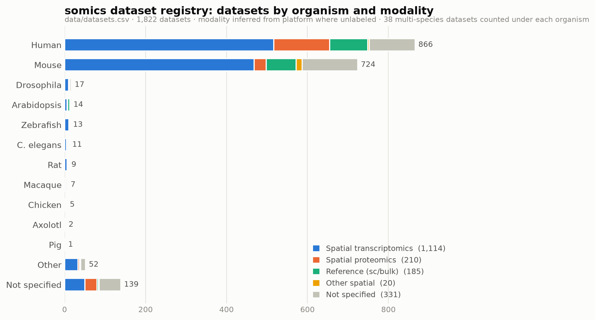
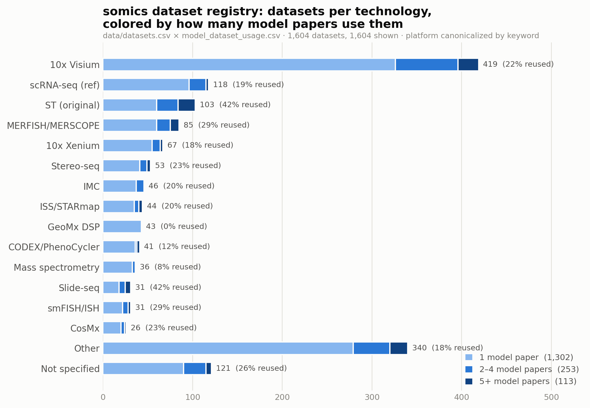
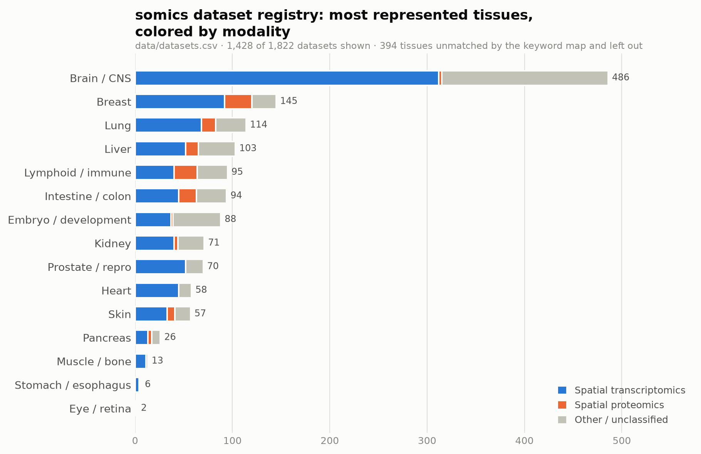
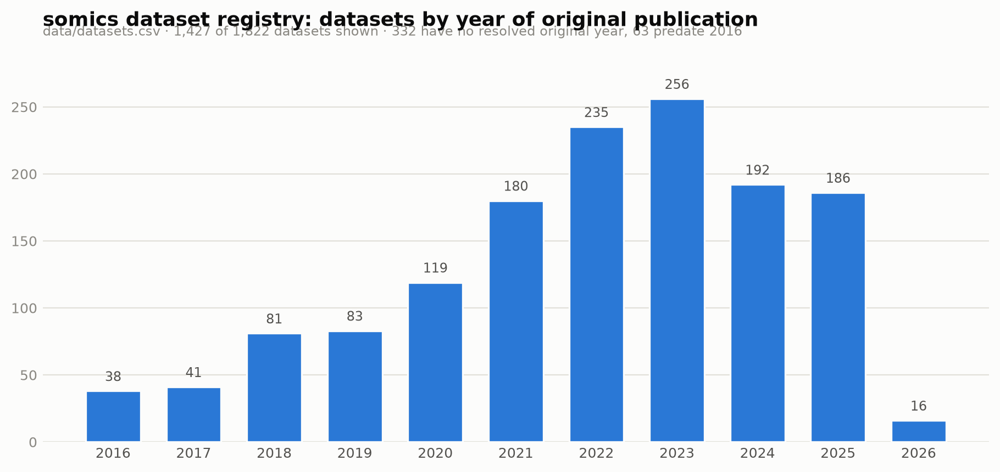

# somics spatial-omics dataset collection

Distribution of the datasets collected in the somics repository (`data/datasets.csv`),
covering spatial-omics technologies, modalities, organisms, tissues, and publication
years.

*Generated 2026-08-18 from `data/datasets.csv` (1,822 datasets), `data/literature_datasets.csv`
(2,429 claim rows from 490 papers) and `data/model_dataset_usage.csv` (3,771 usage rows).*

---

## At a glance

| | |
|---|---|
| Curated datasets | **1,822** |
| Source papers mined | **490** |
| Datasets with a resolved original publication | **1,158** (64%) |
| Datasets with a data access link | **964** (53%) |
| Datasets with a direct download URL | **324** (18%) |
| Datasets first released by the paper analysing them | **651** (36%) |
| Datasets carrying a perturbation annotation | **69** |
| Distinct named models observed | **95** |

The registry is one row per dataset, keyed to the paper that **first released** the data.
Where a dataset debuted in a model paper — TERRA's in-house Xenium pancreas, KRONOS's
private cohorts — that model paper is its original reference.

---

## Modality and organism

Spatial transcriptomics dominates at **954 datasets**, against **133** for spatial
proteomics; **735** remain unclassified because the platform string didn't match either
keyword set, and a blank is preferred to a guess.

Human (**866**) and mouse (**724**) account for almost everything. The long tail is real
but thin: Drosophila 17, Arabidopsis 14, zebrafish 13, C. elegans 11, rat 9, macaque 7.
Thirty-eight datasets span more than one organism and are counted under each, so the bars
sum to slightly more than 1,822.

## Technology, and who actually uses it

10x Visium is the single largest technology at **447 datasets** — more than the next three
combined — followed by MERFISH/MERSCOPE (94), Xenium (73), Stereo-seq (59) and GeoMx DSP
(51). On the proteomics side CODEX/PhenoCycler (48), IMC (47) and MIBI trail well behind.

The striking number is the grey band: **1,567 of 1,822 datasets (86%) have no named model
using them.** Only 252 are used by one named model, 55 by two to four, and 17 by five or
more. Reuse is concentrated in a handful of classics — the DLPFC Visium sections, MERFISH
mouse brain, MOSTA — while most of the registry has never been touched by a published
model.

Two caveats on that number. Every dataset has at least one row in the usage table by
construction, because the paper reporting it becomes a usage row; "used by a model" here
means a usage row whose model field carries an actual model name rather than a fallback
paper id. And that name is detected from a `Name:` prefix in the paper title, so a model
paper titled without one is undercounted.

## Tissue coverage

Brain and CNS dominate at **486 datasets**, roughly three times the next tissue. Breast
(145), lung (114), liver (103), lymphoid/immune (95) and intestine/colon (94) form the
second tier. Stomach/esophagus (6) and eye/retina (2) are close to absent — a genuine gap
rather than a search artefact, since the organ sweep specifically queried them.

394 datasets are excluded here because their free-text tissue didn't match the keyword
map; they are not silently folded into a bucket.

## When the data was published

Dated by the *original* publication, the collection tracks the field's growth from the
2016 introduction of spatial transcriptomics through a steep ramp in 2022–2024. Recent
years are undercounted, not shrinking: paperclip's bioRxiv ingestion lags publication by
roughly three months, so the newest work is systematically missing.

---

## How the collection was built

Four stages, all re-runnable from the repo (see `.claude/skills/harvest-datasets/SKILL.md`):

1. **Search** — paperclip queries over the full-text corpus. Coverage is a function of
   vocabulary, and each new axis has exposed a large blind spot: a perturbation sweep came
   back 74% unmined, an atlas/reference sweep 92%, a consortium/organ sweep 46%.
2. **Claim extraction** — one `map` pass per paper into a strict JSON schema, producing
   `literature_datasets.csv`: one row per (dataset × source paper).
3. **Original-publication tracing** — a second pass expands each paper's dataset citations
   from its own reference list, deduped by (original publication × platform) and resolved
   to DOIs through Crossref. This is what makes `datasets.csv` one row per dataset.
4. **Link resolution and verification** — `resolve_download_urls.py` turns accessions into
   fetchable URLs (Zenodo, GEO, Dryad); `verify_downloads.py` probes each link.

## Known limits

- **Link verification is partial.** 1,028 claim rows carry a verdict (572 yes / 66 no /
  38 unverified / 352 no link); the 1,401 rows added since that pass are unverified.
- **664 datasets have no resolved original publication** — Crossref couldn't confidently
  match the citation, or the source is a vendor or portal resource.
- **735 datasets have no modality** and **394 no mapped tissue** — unmatched free text,
  left blank deliberately.
- **The perturbation column is a partial back-fill** (69 rows) joined from claim rows, not
  a native field of the trace schema.
- **Extraction is LLM-based**, spot-checked rather than verified row by row. The one
  exhaustively verified pass was a 38-candidate link-filling round, of which 12 were kept.
- **Dedup is conservative** — same original publication and platform family — so
  near-duplicates from differently-worded citations may remain.
